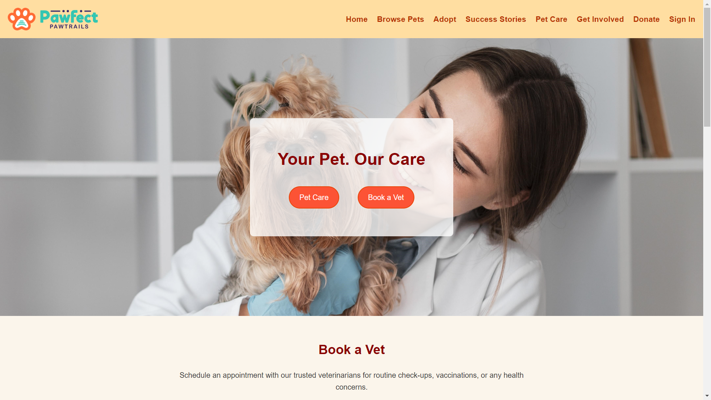

# Pawfect Pawtrails

Pawfect Pawtrails is a website dedicated to helping pets find their forever homes. Our mission is to promote pet adoption, provide resources for pet care, and support animal welfare organizations.

## Features

- **Browse Pets**: Explore the variety of dogs and cats.
- **Adoption Process**: Learn about the adoption process and submit your adoption application online.
- **Pet Care**: Access valuable information and resources for caring for your furry friends, including vet booking, pet products.
- **Success Stories**: Read heartwarming stories of pets who found their loving families through our platform.
- **Get Involved**: Discover ways to support our cause, such as volunteering or donating.

## Image Preview of the Site

## Other

The images used or the names of the products or any of such thing is not owned by me and is available in public domain or is completely open source.
Also my first project ^-^
Thank you!
